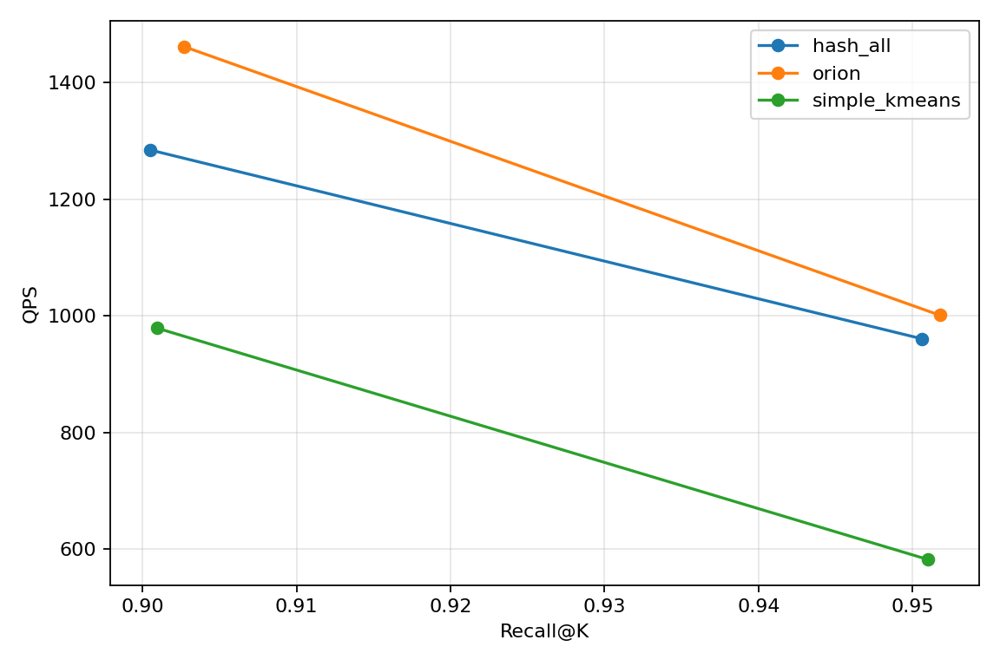
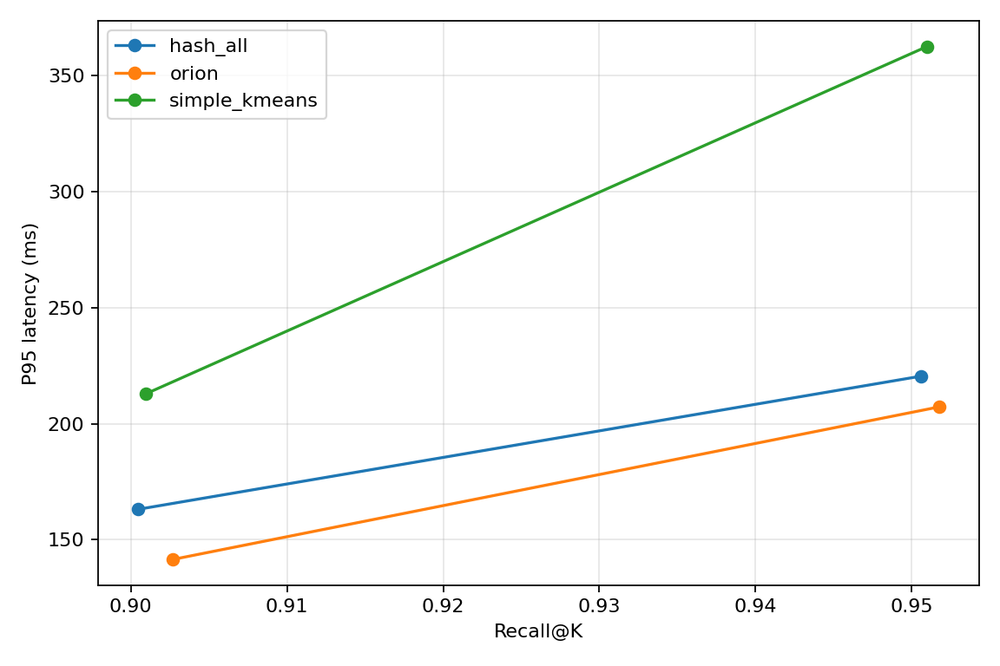
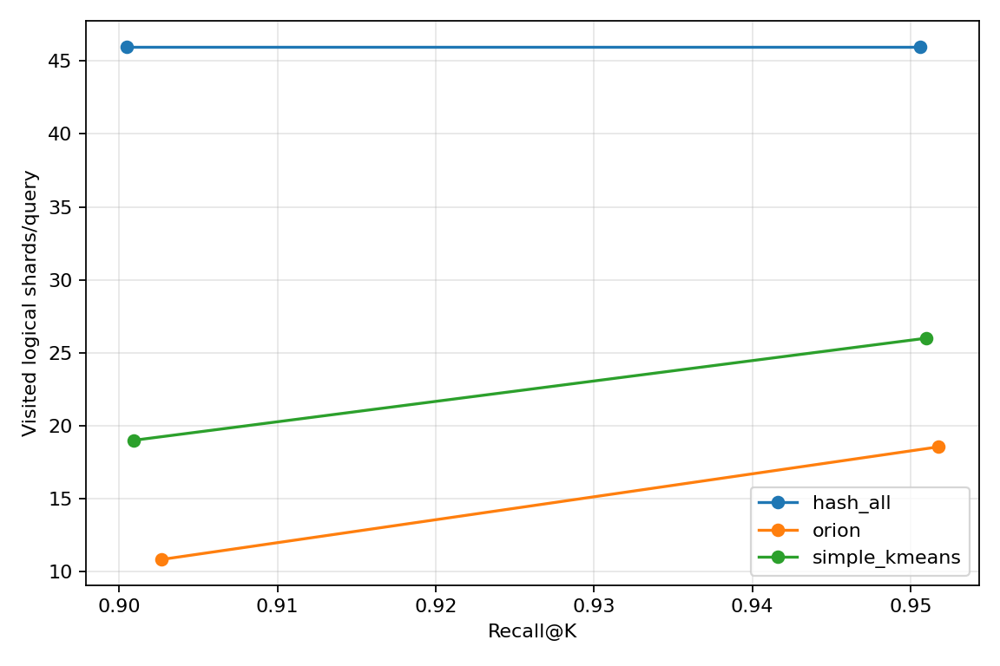
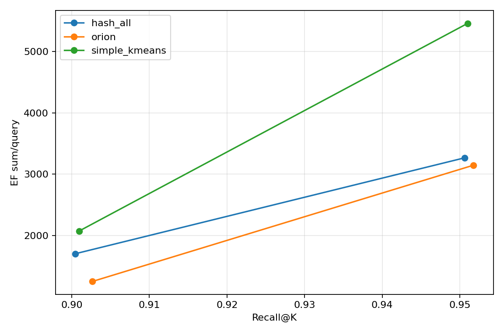

# Orion Native v4 四节点分布式 strict same-recall 结果

## 结论

本轮正式结果来自四节点 native v4 strict matrix：

```text
cluster run id: native-20260721-glove200-full-v4
matrix run id:  flat-vector-8cb09227-v2-peer8-local8-exclusive-20260723T101800Z
commit:         8cb09227bc3ba23581f1f3de087af0cb6fc2b6cd
```

在完整 GloVe-200/Cosine 数据集、相同四节点集群、相同 46-shard worker-only
round-robin placement、相同 HNSW build 参数以及标准 controller Search API 下，8cb Orion
在两个预声明召回目标都是本次六点矩阵中 QPS 最高的方法：

- 约 0.90 Recall@10：Orion 为 `1462.13 QPS`，比 HashAll 高 `13.81%`，比
  Simple KMeans 高 `49.38%`；
- 约 0.95 Recall@10：Orion 为 `1001.04 QPS`，比 HashAll 高 `4.21%`，比
  Simple KMeans 高 `72.06%`；
- Orion 的 200-query HTTP batch P95 在两个目标上分别比 HashAll 低 `13.27%` 和
  `6.01%`；
- 三种方法在两个目标上的最大 pairwise recall spread 分别为 `0.00220` 和
  `0.00117`，均通过预声明的 `0.003` strict same-recall window；
- 新完成的 8cb r095 6+6 AB/BA 交错实验中，Orion arm mean 为
  `987.6643 QPS`，HashAll 为 `970.4062 QPS`，Orion 高 `1.77845%`。Welch 与 exact
  unpaired permutation 检验的双侧 p 值分别为 `0.011518` 和 `0.019481`；更保守的
  adjacent-block paired t 检验为 `p=0.061278`，exact sign-flip 为 `p=0.125`。

因此，当前结果支持以下有限而明确的结论：

> 在本次 GloVe-200、RF=1、remote-only lower shards、wire v2、8 shards/RPC 的四节点
> 系统配置中，保持 Orion 完整路由与 Dynamic EF 语义的 8cb 实现，在约 0.90 与约
> 0.95 的 strict same-recall 点均优于 Simple KMeans，并在本轮完整矩阵中也优于 Qdrant
> HashAll。

这仍不应扩大为“Orion 已在所有 Qdrant 分布式场景中确定优于默认方案”。8cb 已完成新的
HashAll/Orion 6+6 AB/BA 交错确认，arm-level 未配对统计支持正向差异；但六个 adjacent
blocks 中只有四个是 Orion 更快，paired mean 的 95% CI 为
`[-1.192, +35.708] QPS`，仍跨过零，exact paired evidence 也未达到 0.05。历史 88a 的
相同目标交错实验还曾观察到 Orion `-1.083%` 的非显著趋势。因此最保守的结论是：8cb
在 full matrix 与交错 arm mean 上都呈正向，并已有一部分统计支持，但 block-stable 的确定
优势仍需更多重复，而不是把任一单次窗口写成普适事实。

## 8cb 修改了什么

8cb 只优化 production `OrionRouter` 的 upper-vector 内存表示：

- 旧实现让每个 `RuntimeUpperNode` 单独拥有一个 `Vec<f32>`；
- 新实现按原 node index 顺序，把全部 upper vectors 放入一个连续的 `Box<[f32]>`；
- 每个 node 仍逐个调用原来的 Qdrant `preprocess_vector`；
- graph、node index、external label、完整 shard membership、neighbor encounter order、
  upper search、ordered-unique MultiEP 和 Dynamic EF 均未改变；
- `distance_to` 仍调用同一 Qdrant SIMD similarity 路径；
- 新增 `node_count * dimension` 溢出检查和连续主 allocation 失败错误。

8cb 没有修改或裁剪：

- upper-k 或 upper-EF；
- visited logical shards；
- 任一 shard 的完整 membership 或 entry-point 列表；
- `EF = base + factor * routed_EP_count`；
- multi-assignment、source-ID dedup、worker peer-local partial merge；
- lower HNSW work、RPC shard chunk size或 physical placement。

代码门禁为：

```text
cargo fmt --all -- --check                         passed
cargo check -p collection                          passed
cargo test -p collection orion -- --nocapture      51 passed, 0 failed
```

## 真实运行架构

### 节点与网络

| 角色 | 主机 | qdrant-lan | Qdrant CPU | 说明 |
|---|---|---:|---:|---|
| controller + benchmark client | `hp057` | `10.10.1.1` | `0-7` | client 由 `taskset -c 8-19` 运行 |
| worker 1 | `hp052` | `10.10.1.2` | `0-19` | lower shards only |
| worker 2 | `hp065` | `10.10.1.3` | `0-19` | lower shards only |
| worker 3 | `hp076` | `10.10.1.4` | `0-19` | lower shards only |

所有节点使用 host network。客户端只访问 controller 的标准 REST Search API：

```text
http://10.10.1.1:6333
```

Qdrant peer URI 分别为 `10.10.1.1/.2/.3/.4:6335`。lower shard fan-out、P2P 和
worker 返回流量都在 `10.10.1.0/24` 私网内完成。

### Collection 与 placement

正式运行共有五个 collection：一个 HashAll、两个 Orion 参数点和两个 Simple KMeans
参数点。每个 collection 都满足：

- `sharding_method=auto`；
- 46 个 numeric logical shards；
- replication factor 1、write consistency factor 1；
- 每个 shard 恰有一个 Active remote replica；
- controller lower-local-shard count 为 0；
- 三个 workers 使用完全相同的 exact round-robin placement，分布为 `15/16/15`；
- 无 shard transfer，collection status green，optimizer OK，update queue 为 0。

四个容器运行完全相同的 image ID：

```text
sha256:6f17d9f9efcb67c3188019321df98d60a28c764ffe3ee4806512c1891f029319
```

Orion 使用 compact wire v2、worker peer-local pre-merge 和 `8 shards/RPC`。固定 200-query
transport probe 中，三个 workers 各收到 2 次
`CoreSearchBatchByShardCompact`，总计 6 次；legacy `CoreSearchBatch` 与
`CoreSearchBatchByShard` 的 delta 都为 0。

### 查询执行链

正式 Orion 路径是：

```text
standard Qdrant Search API
  -> controller collection coordinator
  -> production upper HNSW
  -> complete shard-membership union
  -> ordered-unique MultiEP per logical shard
  -> per-query/per-shard Dynamic EF
  -> ordinary Qdrant ShardReplicaSet
  -> remote worker lower HNSW
  -> worker peer-local partial top-k merge
  -> controller distance-aware global merge
  -> external/source-ID dedup
```

客户端请求不含 shard selector、entry points、per-shard EF map 或 source-ID hint。Orion
替换的是默认 auto-shard 的数据放置和 query routing，而不是旁路 controller/worker 集群、
直接请求 workers 或使用独立检索服务。

## 公平性边界

本次实验在下列方面保持一致：

| 维度 | 统一条件 |
|---|---|
| 硬件与时间窗口 | 同一四节点集群；六个 case 在同一个新 image/commit 下重新运行 |
| 客户端入口 | controller 标准 Search API；禁止直接对 worker 测主结果 |
| 数据与查询 | 同一完整 GloVe-200 train/test/neighbors；同一 warmup 与 timed query prefix |
| metric | Cosine/Angular，Recall@10，top-k 10 |
| shard 架构 | 46 numeric auto-shards、RF=1、相同 worker-only round-robin placement |
| lower index build | `m=32`、`ef_construct=100`、`full_scan_threshold=10` |
| benchmark | 500 warmup、3,000 timed queries、batch 200、3 repeats、client CPUs `8-19` |
| readiness | green、无 transfer、optimizer OK、update queue empty |

三种方法的必要差异如下：

| 方法 | 数据放置 | 查询路由 | lower search | physical vectors |
|---|---|---|---|---:|
| HashAll | Qdrant hash，单分配 | 全部 46 shards | 每 shard 固定 EF | 1,183,514 |
| Simple KMeans | 最近 centroid，单分配 | server-side exact centroid top-`nprobe` | 普通 HNSW entry point、固定 EF | 1,183,514 |
| Orion | topology voting multi-assignment | upper HNSW 完整 membership union | ordered MultiEP、Dynamic EF | 1,394,406 |

Orion expansion 为：

```text
1,394,406 / 1,183,514 = 1.1781913859912092x
```

因此，这是一项公平的**端到端分布式系统替代方案比较**：相同 API、Qdrant
coordinator/ShardReplicaSet 架构、硬件、数据、placement 和 index build 参数下，比较各完整
方法的 Recall–QPS。但它不是“只改变 shard selector 的纯算法微基准”：Orion 使用
`17.82%` 的额外 physical vector copies，并包含 compact peer RPC 与 worker partial merge。
这些都是候选系统设计的一部分，也必须作为资源成本披露，不能据此声称三种方法具有完全相同
的存储或 transport footprint。

## 冻结环境与 provenance

| 项目 | 值 |
|---|---|
| source/deployment commit | `8cb09227bc3ba23581f1f3de087af0cb6fc2b6cd` |
| image tag | `orion-method4:8cb09227bc3b-source-1f6c67b9bad0` |
| image ID | `sha256:6f17d9f9efcb67c3188019321df98d60a28c764ffe3ee4806512c1891f029319` |
| source fingerprint | `1f6c67b9bad031aabad842a971888ba4795809be7953f4989db8a82e73f051aa` |
| image tar SHA-256 | `0b9cc53b3119b33a1e9603cd894742b88b7fd754e87349729e17e079fff8d685` |
| deployment manifest SHA-256 | `06861871b7d12649a2719d481e454d8f23aeb2f99d00e11f8104e37a1484c3fb` |
| compact wire | v2 |
| peer pre-merge | enabled，8 shards/RPC |
| dataset | `glove-200-angular.hdf5` |
| dataset source | `https://ann-benchmarks.com/glove-200-angular.hdf5` |
| dataset SHA-256 | `4839085e5a8bb293434a1a66e1aa0193afc3f07c6797a85f1dbd91656172da20` |
| train/test/neighbors | `1,183,514 x 200` / `10,000 x 200` / `10,000 x 100` |
| matrix config SHA-256 | `a75e2148f7c422f1dde7bd9e2c2f94204602ff05ace23e73c7053a783f6586b5` |
| topology canonical identity SHA-256 | `e1dd18dfb49212f54d42c0c280fe9b48faf82c89198ade5566b4d9bc47c7f343` |

数据集本地路径为：

```text
/users/dry/orion-distributed/datasets/glove-200-angular.hdf5
```

HDF5、route trace、逐查询指标、Qdrant storage/index/WAL 和 image tar 都保留在 Git 外。

## Strict same-recall 规则

矩阵对每种方法都要求：

```text
abs(actual Recall@10 - target) <= 0.003
```

同时要求同一目标内三种方法的最大 pairwise recall spread：

```text
max(recall) - min(recall) <= 0.003
```

实际门禁结果为：

| 目标 | HashAll recall | Orion recall | Simple recall | 最大 spread | 结果 |
|---:|---:|---:|---:|---:|---|
| 0.90 | 0.9004667 | 0.9026667 | 0.9009333 | 0.0022000 | strict pass |
| 0.95 | 0.9506000 | 0.9517667 | 0.9510000 | 0.0011667 | strict pass |

## 正式六点结果

QPS 和 latency 都是三个 3,000-query repeats 的算术均值；`±` 是 repeat 间 sample
standard deviation。P50/P95/P99 是每个 200-query HTTP batch 的 latency，不是单查询
latency。

| 目标 | 方法 | 参数 | Recall@10 | QPS mean ± sd | Batch P50 / P95 / P99 ms | Avg shards | EF-sum/query |
|---:|---|---|---:|---:|---:|---:|---:|
| 0.90 | HashAll | `EF37` | 0.9004667 | 1284.67 ± 3.79 | 154.95 / 163.08 / 164.12 | 46.0000 | 1702.000 |
| 0.90 | Orion | `u48,b48,f14,g7` | 0.9026667 | 1462.13 ± 8.09 | 136.24 / 141.44 / 142.45 | 10.8253 | 1249.716 |
| 0.90 | Simple KMeans | `nprobe19,EF109,g11` | 0.9009333 | 978.83 ± 13.07 | 204.49 / 212.80 / 214.26 | 19.0000 | 2071.000 |
| 0.95 | HashAll | `EF71` | 0.9506000 | 960.60 ± 12.44 | 207.71 / 220.47 / 223.13 | 46.0000 | 3266.000 |
| 0.95 | Orion | `u112,b64,f16,g8` | 0.9517667 | 1001.04 ± 5.13 | 198.33 / 207.22 / 208.99 | 18.5493 | 3146.368 |
| 0.95 | Simple KMeans | `nprobe26,EF210,g10` | 0.9510000 | 581.79 ± 3.74 | 342.75 / 362.61 / 367.58 | 26.0000 | 5460.000 |

### 约 0.90

相对 HashAll，Orion：

- QPS 高 `13.81%`；
- Batch P95 低 `13.27%`；
- visited shards 少 `76.47%`；
- EF-sum/query 低 `26.57%`。

相对 Simple KMeans，Orion：

- QPS 高 `49.38%`；
- Batch P95 低 `33.53%`；
- visited shards 少 `43.02%`；
- EF-sum/query 低 `39.66%`。

### 约 0.95

相对 HashAll，Orion：

- QPS 高 `4.21%`；
- Batch P95 低 `6.01%`；
- visited shards 少 `59.68%`；
- EF-sum/query 只低 `3.66%`。

相对 Simple KMeans，Orion：

- QPS 高 `72.06%`；
- Batch P95 低 `42.85%`；
- visited shards 少 `28.66%`；
- EF-sum/query 低 `42.37%`。

0.95 点很重要：Orion 虽然少访问约 60% shards，但 EF-sum 仅比 HashAll 低 3.66%。
因此不能把全部 QPS 差异简单解释为“搜索工作少了 60%”；upper routing、连续 vector
layout 的 CPU/cache 行为、peer grouping、RPC template/override 编码和 merge/dedup 都是
端到端结果的一部分。

## Route 语义门禁

### 10,000-query production-router replay

8cb 在正式 artifact 和同一 10,000-query little-endian float32 输入上生成完整 ordered route
objects。没有把大型 trace 放进 Git；这里只记录 canonical hashes 和 aggregate：

| 目标 | input SHA-256 | per-query canonical SHA-256 | aggregate SHA-256 | Avg visited | Avg EP | EF-sum/query |
|---:|---|---|---|---:|---:|---:|
| 0.90 | `26a52d...cdb6` | `89bf0c...f9ae` | `f7e1e4...5e45` | 10.6882 | 52.0703 | 1242.0178 |
| 0.95 | `26a52d...cdb6` | `269850...936c` | `af8629...fd86` | 18.4382 | 122.3533 | 3137.6976 |

完整 hashes 见
[`route_semantic_hashes.csv`](2026-07-23-orion-native-v4-four-node-results/route_semantic_hashes.csv)。

### 正式 3,000-query prefix 与 88a 对照

正式 timed query prefix 的 byte SHA-256 为：

```text
3c1064531c24b844eaa346bdd60a3ba1abe07d8bc2b14b247b3e1544a64769d5
```

8cb 与 88a 的 3,000 个 ordered route objects 逐对象相同：

| 目标 | per-query canonical SHA-256 | aggregate SHA-256 | 88a 对照 |
|---:|---|---|---|
| 0.90 | `44994ffebfb73bd1a248f9f7058f5c7e1d062414e3454155d343d07ee1fce570` | `6d4d170fc800251428b15714b353a74ac4686d63905e960c173f779a5a27be7f` | identical |
| 0.95 | `fa955a56e7d0164acf61beebd56f030b490cdbbcda2049ce08ffc220d3825892` | `ff9f4048ba3fe83fd37311c41cbf1e728eb7f78301f1cbfa1e1af6e2df1d7025` | identical |

这证明 8cb 的 flat-vector 重构没有改变正式查询的 visited shards、每 shard ordered EP、
Dynamic EF 或 EF-sum。它不单独证明 lower HNSW 在所有并发时序下 bit-identical，因此还需要
下面的 live standard-API transport probe。

### Live standard Search transport probe

两个目标使用同一 200-query 输入、500-query warmup 和 collection placement：

```text
query SHA-256:     1cea9e588c5931b19f0f598276910ca06509487ee0ee86b4aff4b2279d3a1f93
warmup SHA-256:    3ba26807f727c54407222ca2a710957e6366a726442457c1fa45522a68ccce2e
placement SHA-256: 4404312a407c6c48537b717c868805ae48aa3730cf66349ec814378998e6756d
```

| 目标 | result IDs SHA-256 | IDs + little-endian-f32 scores SHA-256 | compact RPC |
|---:|---|---|---|
| 0.90 | `ce427136f203218332dd3b65fc79b453d1dc7efc8c92ffc9a85b248cc86267d0` | `bcb51efb7940a78e538c06f936db66e9d7b3d136f4edb2193e9c104437365dfd` | 2/worker，6 total |
| 0.95 | `e8eef3f2e16182f2e97cab63517dacf5773d2964a92d59531cd376c9bf204c68` | `f3c805d23a0432de7ac29b0597bcc03afdc156fe5546272d649371549a7548c9` | 2/worker，6 total |

这些 hashes 与 88a probe 相同。placement before/after SHA 也相同，说明 probe 期间没有
shard movement。

## 隔离微基准与候选 screen

### Flat-vector 路由微基准

隔离微基准只测 production router 的 10,000-query r095 route planning，不含 HTTP、RPC、
lower HNSW 或 merge。设计为 CPU 9、每个 binary 一次 warmup、6 个 baseline + 6 个
candidate，并使用平衡序列：

```text
A B B A B A A B A B B A
```

| binary | Mean ± sd |
|---|---:|
| 88a baseline | 8.529354 ± 0.055013 s |
| 8cb flat-vector candidate | 7.033018 ± 0.056693 s |

8cb elapsed time 低 `17.5434%`，六个相邻 block 都是 candidate 更快，且每次运行的
aggregate route SHA 均为：

```text
af86295971df9059f289febdc80ed149180e51403245f1ff128067e38cfbfd86
```

这证明连续 upper-vector storage 提升了隔离 route CPU 路径，但 `17.54%` 不能直接解释为
端到端 QPS 应提升相同比例。

### 四节点 r095 screen

完整矩阵前的 8cb 四节点 screen 使用与正式 r095 相同的 `u112/b64/f16/g8`、500 warmup、
3,000 timed queries、batch 200 和 3 repeats：

```text
Recall@10:  0.9517667
QPS:        989.00 ± 3.38
Batch P95:  209.46 ± 3.52 ms
visited:    18.5493
EF-sum:     3146.368
```

artifact validation 与 placement validation 均通过。该 screen 是 deployment/performance
gate，不是与 88a 的公平 A/B；88a 的同名早期 screen 使用不同 timed query count，不能直接
做百分比比较。

## 与 88a 的关系

88a 完整矩阵曾得到：

| 目标 | Orion vs HashAll QPS | Orion vs Simple QPS |
|---:|---:|---:|
| 0.90 | +8.72% | +42.26% |
| 0.95 | -1.12% | +62.10% |

88a 的 r095 6+6 AB/BA 交错实验进一步得到：

```text
HashAll: 972.2189 ± 12.3249 QPS
Orion:   961.6897 ± 11.1125 QPS
delta:   -1.0830%
Welch two-sided p:              0.151522
exact unpaired permutation p:  0.155844
paired block p:                0.065068
paired 95% CI:                 [-22.01696, +0.95864] QPS
exact sign-flip p:             0.0625
```

所以 88a 只显示约 1% 的负向趋势，未达到双侧 0.05，既不能认定显著回退，也没有完成正式
等价证明。

8cb 相对 88a 的 Orion full-matrix 行：

- r090 QPS 高 `4.71%`，P95 低 `4.71%`；
- r095 QPS 高 `4.52%`，P95 低 `4.58%`。

但这是两个独立完整矩阵窗口，不是 paired A/B。同期 HashAll r095 QPS 下降 `0.82%`，
Simple r095 QPS 下降 `1.53%`，说明环境窗口仍有可见漂移。详细行见
[`matrix_comparison_8cb_vs_88a.csv`](2026-07-23-orion-native-v4-four-node-results/matrix_comparison_8cb_vs_88a.csv)。

### 8cb r095 6+6 AB/BA 交错确认

8cb 随后在同一 commit、image、dataset、transport identity、wire v2 和 8 shards/RPC 配置下
完成 12 个单-repeat cases。执行顺序仍是平衡的 AB/BA adjacent-block 设计；HashAll 与
Orion 各 6 次，arm 内 Recall@10 分别固定为 `0.9506` 和 `0.9517667`。

| 指标 | HashAll mean ± sd | Orion mean ± sd | Orion 相对差异 |
|---|---:|---:|---:|
| QPS | 970.4062 ± 10.2324 | 987.6643 ± 9.0382 | +1.77845% |
| Batch P50 ms | 205.2743 ± 0.7112 | 201.5889 ± 1.4924 | -1.79537% |
| Batch P95 ms | 218.2159 ± 7.2121 | 212.0761 ± 3.0326 | -2.81362% |
| Batch P99 ms | 221.0107 ± 9.0816 | 214.9446 ± 6.1936 | -2.74469% |

QPS 的统计结果为：

```text
mean Orion - HashAll:               +17.258163 QPS
Welch two-sided p:                    0.0115179
exact unpaired permutation p:         0.0194805
adjacent-block paired t p:            0.0612775
paired 95% CI:                       [-1.191894, +35.708219] QPS
exact paired sign-flip p:             0.125
positive/negative adjacent blocks:    4 / 2
```

这组结果不能压缩成单一“显著”或“不显著”标签：

- 把每个 run 作为 arm-level observation 的 Welch 和 exhaustive unpaired permutation
  检验均在双侧 0.05 下支持 Orion QPS 更高；
- 按实验设计显式控制相邻时间 block 的 paired t 检验接近但没有达到 0.05，paired 95% CI
  仍跨零；只有 6 个 block 时，exact sign-flip 的离散双侧 p 值为 0.125；
- 因此证据支持 8cb 的正向平均差异，并与 full matrix 的方向一致，但尚不足以声称每个时间
  block 都稳定获胜或已经得到强 exact-paired significance。

latency arm means 也都低于 HashAll，但只有 P50 的 paired t 与 exact sign-flip 同时低于
0.05；P95/P99 的 paired 和 unpaired 检验都未达到 0.05。因此支持的 latency 结论是 P50
改善较稳健，P95/P99 为正向均值趋势，而不是已经证明 tail latency 显著下降。

综合隔离微基准、完整 strict matrix 和新的 6+6 交错实验，最稳妥的表述更新为：8cb 的
flat-vector 实现保持 route 语义不变，r095 端到端平均性能方向已从 88a 的轻微负向转为正向；
未配对统计支持这一正向差异，而 block-paired exact evidence 仍保留不确定性。完整统计见
[`r095_interleaved_8cb_summary.csv`](2026-07-23-orion-native-v4-four-node-results/r095_interleaved_8cb_summary.csv)。

## 图表

### Recall–QPS



### Recall–batch latency



### Recall–visited shards



### Recall–EF-sum



## 局限与不能据此声称的内容

1. 本轮只有 GloVe-200/Cosine 和约 0.90、0.95 两个召回目标，没有验证其他数据集、
   Euclidean/Dot、0.97/0.99 或不同 shard counts。
2. 完整矩阵每个 case 只有 3 个 repeats；新增 r095 交错实验也只有 6 个 adjacent blocks。
   交错 arm mean 为 `+1.77845%`，低于完整矩阵的 `+4.21%`，paired 95% CI 仍跨零，说明
   实际优势大小存在窗口敏感性，不能写成跨环境的确定常数。
3. P50/P95/P99 是 200-query HTTP batch latency，不能写成单 query tail latency。
4. Orion visited shards 与 EF-sum 来自计时窗口外、对 verified artifact/query 运行同一
   production router 的 exact replay；它不是 server/network instrumentation。
5. 当前安全域是 Cosine/LargeBetter、RF=1、无显式 read consistency、controller 无 lower
   replica、所有 lower shards remote。结果不能直接外推到 RF>1、controller-local replicas、
   replica failover 或 mixed local/remote merge。
6. Orion 和 Simple routed policy 当前是静态/read-only layout；本轮没有验证完整在线 CRUD、
   hot generation activation、resharding 或 failure recovery。
7. controller Qdrant CPUs `0-7` 与 client logical CPUs `8-19` 不重号，但 `0-7` 与
   `10-17` 是 SMT siblings，不是物理核心完全隔离。
8. Orion 使用 `1.17819x` physical vectors 和自定义 compact peer transport。当前结果没有
   同时报告 index bytes、RAM、CPU cycles、energy 或 network bytes，因此不能声称相同资源
   footprint 下无条件占优。
9. route semantic hashes 证明给定 artifact/query 的 routing plan 保持不变；它不等于对任意
   Qdrant 版本、任意并发调度或任意 CPU architecture 的 bitwise execution proof。

## 小型证据包与原始产物

Git 内的小型证据包位于：

```text
docs/experiments/2026-07-23-orion-native-v4-four-node-results/
```

其中包括：

- `same_recall_confirmation.csv`：strict same-recall gate；
- `recall_qps_points.csv`：正式六点 aggregate；
- `matrix_comparison_8cb_vs_88a.csv`：两个完整矩阵窗口的逐 case 对照；
- `r095_interleaved_summary.csv`：88a 历史 6+6 AB/BA 汇总与统计；
- `r095_interleaved_8cb_summary.csv`：8cb 新 6+6 AB/BA 汇总与统计；
- `route_semantic_hashes.csv`：10k/3k route 和 live transport hashes；
- `candidate_screen.csv`：8cb r095 四节点 screen；
- `flat_vector_route_microbenchmark_summary.csv` 与
  `flat_vector_route_microbenchmark_runs.csv`：隔离路由微基准；
- 四张正式图；
- `artifact_checksums.tsv`：小型证据和外部权威 source artifacts 的 SHA-256。

正式 raw matrix 保留在 Git 外：

```text
/proj/intelisys-PG0/exp/orion-distributed/
  native-20260721-glove200-full-v4/
  matrix/flat-vector-8cb09227-v2-peer8-local8-exclusive-20260723T101800Z/
```

复现矩阵的入口为：

```bash
RUN_ROOT=/proj/intelisys-PG0/exp/orion-distributed/native-20260721-glove200-full-v4

/users/dry/orion-distributed/venv/bin/python \
  tools/native_auto_shard_matrix.py \
  --config tools/benchmark_configs/native_auto_shard_glove200_v4_strict.json \
  --run-id flat-vector-8cb09227-v2-peer8-local8-exclusive-20260723T101800Z \
  --output-root "$RUN_ROOT/matrix" \
  --taskset-cpus 8-19 \
  --run
```

直接复现前必须先确认 live deployment 的 commit/image、wire v2、8 shards/RPC、46-shard
placement 和 collection readiness 与本文冻结值一致。若同名 output directory 已存在，应使用
新的 run-id，而不是覆盖本次正式 raw evidence。
